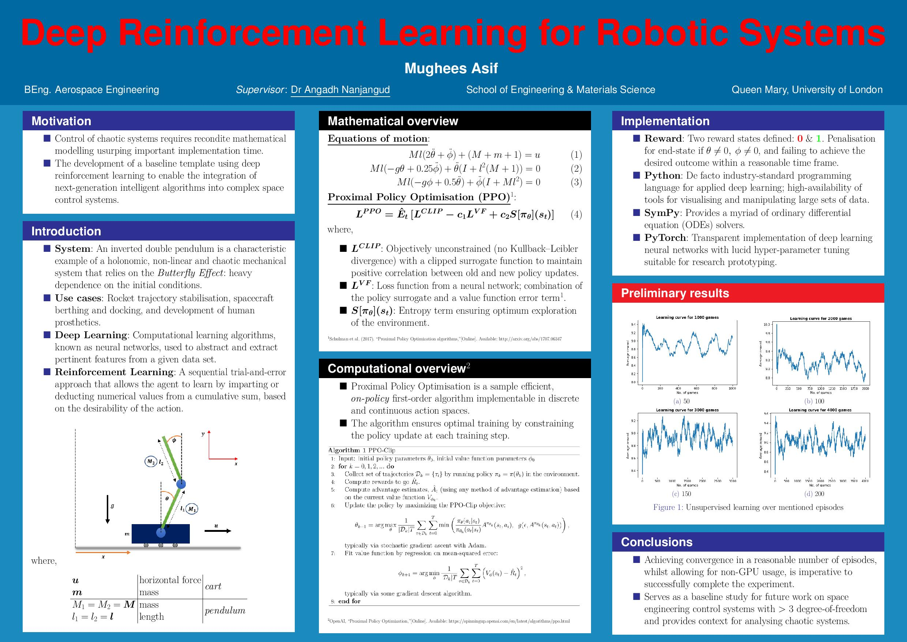

## Deep Reinforcement Learning for Robotic Systems

    

## Notes 

* GitHub has an ongoing problem rendering Jupyter Notebooks. Please view the final notebook version **[here](https://nbviewer.jupyter.org/github/mughees-asif/dip/blob/master/deep-learning-dip.ipynb)**.
* To read the accompanying written evaluation, please see **[this](https://drive.google.com/file/d/1cvxC5QPPS9X9DEcnlZfgxMtREl2IGdMo/)**.
* For a quick overview, check out **[this](https://github.com/mughees-asif/dip/blob/master/project.pdf)**.

## Environment Setup

* Install Miniconda: https://docs.conda.io/en/latest/miniconda.html
* Open terminal: `git clone git@github.com:mughees-asif/dip.git`
* Create new environment [enter custom name instead of <ENV_NAME>] in the same directory through the Miniconda terminal: `conda create -n <ENV_NAME> python sympy numpy matplotlib` 
* Install `PyTorch`: https://pytorch.org/get-started/locally/
* Install Jupyter Notebook: `conda install -c conda-forge notebook`
* Navigate to the environment directory & open this notebook through the Miniconda terminal: `jupyter notebook`
* You should now be set-up to run this example
* Any problems: [email me](mailto:mughees460@gmail.com)

## [Project Poster](https://github.com/mughees-asif/dip/blob/master/images/poster.jpg)

    

